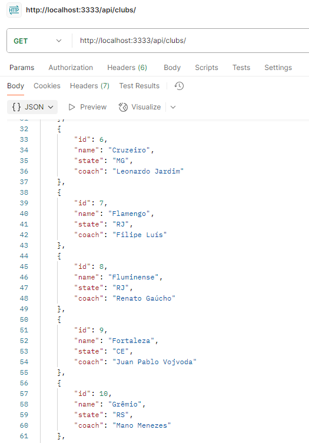
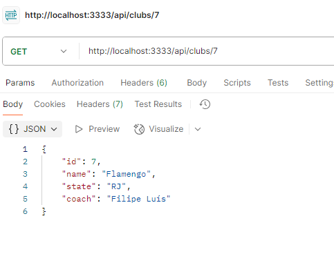
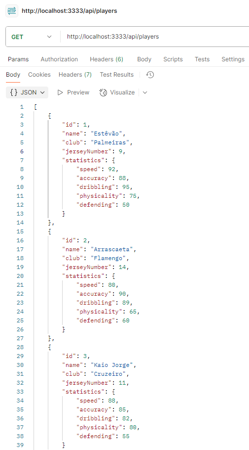
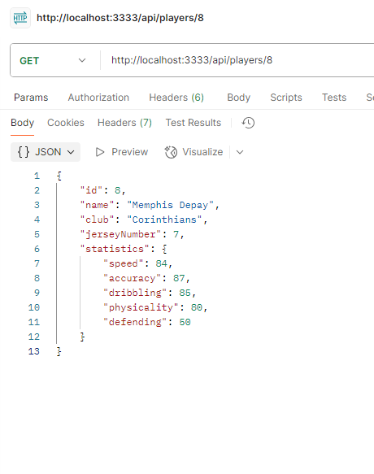
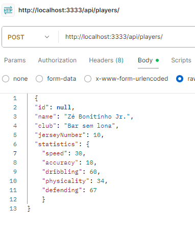
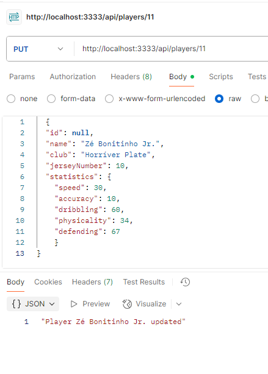

# Brasileirão API

A simple Node.js and Express API providing updated data on Brazilian football clubs and players from the 2025 season.  

---

## 🚀 Routes

### Players
- **GET** `/players` → Get all players  
- **GET** `/players/:id` → Get player by ID  
- **POST** `/players` → Add a new player  
- **PUT** `/players/:id` → Update a player by ID  
- **DELETE** `/players/:id` → Delete a player by ID  

### Clubs
- **GET** `/clubs` → Get all clubs  
- **GET** `/clubs/:id` → Get club by ID  

---

## 📂 Project Structure
```

/src
/controllers
clubController.ts
playerController.ts
/models
clubModel.ts
playerModel.ts
/repositories
clubRepository.ts
playerRepository.ts
/routes
routes.ts
/services
/utils
app.ts
server.ts

```

## Screenshots








---

## 🛠️ How to Run
```bash
# Install dependencies
npm install

# Run the server
tsx watch --env-file=.env src/server.ts
````

The server will be available at:
`http://localhost:PORT`
